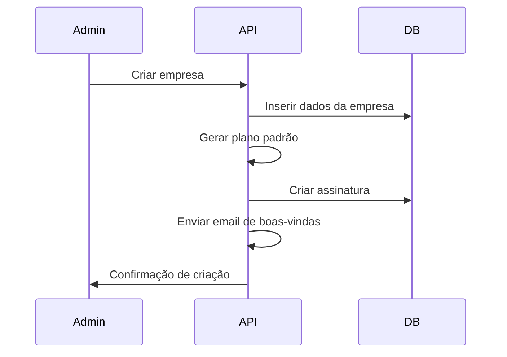
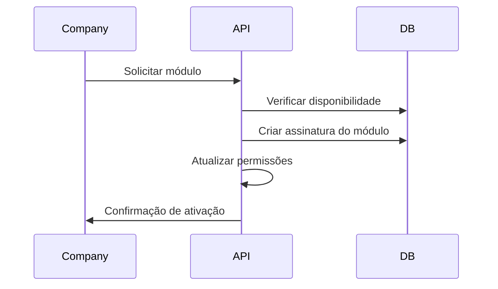
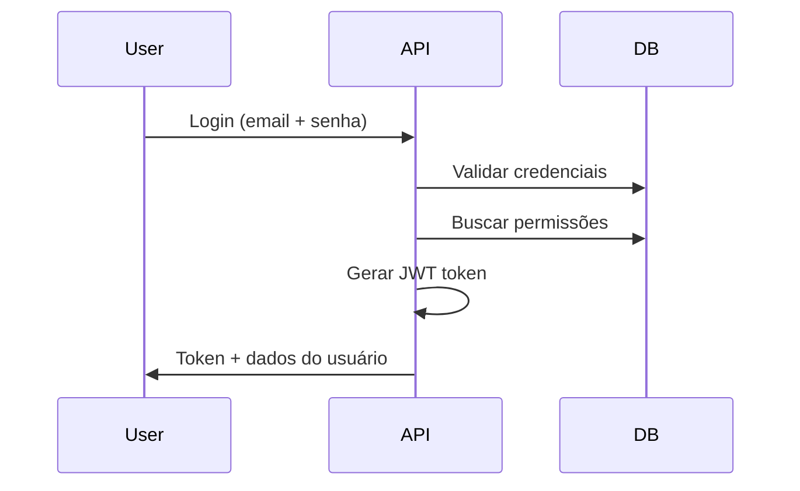

# Arquitetura do Sistema SaaS Multiempresa - FinanceMax

## 📋 Visão Geral

O FinanceMax é um sistema SaaS multiempresa que permite múltiplas empresas gerenciarem suas operações financeiras e comerciais através de uma plataforma unificada, com isolamento completo de dados e controle granular de acesso.

## 🏗️ Arquitetura Geral

### Estrutura de Camadas
```
┌─────────────────────────────────────┐
│           Frontend (React)          │
│  ┌─────────────────────────────┐    │
│  │   Portal Empresa (Cliente)  │    │
│  └─────────────────────────────┘    │
│  ┌─────────────────────────────┐    │
│  │  Painel Admin (Sistema)     │    │
│  └─────────────────────────────┘    │
└─────────────────────────────────────┘
                    │
┌─────────────────────────────────────┐
│         API Gateway / Load Balancer │
└─────────────────────────────────────┘
                    │
┌─────────────────────────────────────┐
│         Backend (FastAPI)           │
│  ┌─────────────────────────────┐    │
│  │    Autenticação & Auth      │    │
│  └─────────────────────────────┘    │
│  ┌─────────────────────────────┐    │
│  │    Gestão de Empresas       │    │
│  └─────────────────────────────┘    │
│  ┌─────────────────────────────┐    │
│  │    Gestão de Planos         │    │
│  └─────────────────────────────┘    │
│  ┌─────────────────────────────┐    │
│  │    Módulos de Negócio       │    │
│  └─────────────────────────────┘    │
└─────────────────────────────────────┘
                    │
┌─────────────────────────────────────┐
│         PostgreSQL Database          │
│  ┌─────────────────────────────┐    │
│  │    Schema Multi-tenant      │    │
│  └─────────────────────────────┘    │
└─────────────────────────────────────┘
```

## 🏢 Modelo de Dados

### Entidades Principais

#### 1. Empresa (Company)
```sql
CREATE TABLE companies (
    id UUID PRIMARY KEY DEFAULT gen_random_uuid(),
    name VARCHAR(255) NOT NULL,
    corporate_name VARCHAR(255) NOT NULL,
    cnpj VARCHAR(18) UNIQUE NOT NULL,
    email VARCHAR(255) UNIQUE NOT NULL,
    phone VARCHAR(20),
    address TEXT,
    city VARCHAR(100),
    state VARCHAR(2),
    zip_code VARCHAR(10),
    status VARCHAR(20) DEFAULT 'active',
    plan_type VARCHAR(50) DEFAULT 'basic',
    created_at TIMESTAMP DEFAULT NOW(),
    updated_at TIMESTAMP DEFAULT NOW()
);
```

#### 2. Filial (Branch)
```sql
CREATE TABLE branches (
    id UUID PRIMARY KEY DEFAULT gen_random_uuid(),
    company_id UUID REFERENCES companies(id) ON DELETE CASCADE,
    name VARCHAR(255) NOT NULL,
    cnpj VARCHAR(18) UNIQUE NOT NULL,
    address TEXT,
    city VARCHAR(100),
    state VARCHAR(2),
    zip_code VARCHAR(10),
    status VARCHAR(20) DEFAULT 'active',
    created_at TIMESTAMP DEFAULT NOW(),
    updated_at TIMESTAMP DEFAULT NOW()
);
```

#### 3. Usuário (User)
```sql
CREATE TABLE users (
    id UUID PRIMARY KEY DEFAULT gen_random_uuid(),
    company_id UUID REFERENCES companies(id) ON DELETE CASCADE,
    branch_id UUID REFERENCES branches(id) ON DELETE SET NULL,
    email VARCHAR(255) UNIQUE NOT NULL,
    password_hash VARCHAR(255) NOT NULL,
    first_name VARCHAR(100) NOT NULL,
    last_name VARCHAR(100) NOT NULL,
    role VARCHAR(50) DEFAULT 'user',
    status VARCHAR(20) DEFAULT 'active',
    last_login TIMESTAMP,
    created_at TIMESTAMP DEFAULT NOW(),
    updated_at TIMESTAMP DEFAULT NOW()
);
```

#### 4. Plano (Plan)
```sql
CREATE TABLE plans (
    id UUID PRIMARY KEY DEFAULT gen_random_uuid(),
    name VARCHAR(100) NOT NULL,
    description TEXT,
    price DECIMAL(10,2) NOT NULL,
    billing_cycle VARCHAR(20) DEFAULT 'monthly',
    max_users INTEGER DEFAULT 1,
    max_branches INTEGER DEFAULT 1,
    status VARCHAR(20) DEFAULT 'active',
    created_at TIMESTAMP DEFAULT NOW(),
    updated_at TIMESTAMP DEFAULT NOW()
);
```

#### 5. Módulo (Module)
```sql
CREATE TABLE modules (
    id UUID PRIMARY KEY DEFAULT gen_random_uuid(),
    name VARCHAR(100) NOT NULL,
    code VARCHAR(50) UNIQUE NOT NULL,
    description TEXT,
    price DECIMAL(10,2) NOT NULL,
    category VARCHAR(50),
    status VARCHAR(20) DEFAULT 'active',
    created_at TIMESTAMP DEFAULT NOW(),
    updated_at TIMESTAMP DEFAULT NOW()
);
```

#### 6. Plano-Módulo (PlanModule)
```sql
CREATE TABLE plan_modules (
    id UUID PRIMARY KEY DEFAULT gen_random_uuid(),
    plan_id UUID REFERENCES plans(id) ON DELETE CASCADE,
    module_id UUID REFERENCES modules(id) ON DELETE CASCADE,
    is_included BOOLEAN DEFAULT true,
    price_override DECIMAL(10,2),
    created_at TIMESTAMP DEFAULT NOW(),
    UNIQUE(plan_id, module_id)
);
```

#### 7. Assinatura da Empresa (CompanySubscription)
```sql
CREATE TABLE company_subscriptions (
    id UUID PRIMARY KEY DEFAULT gen_random_uuid(),
    company_id UUID REFERENCES companies(id) ON DELETE CASCADE,
    plan_id UUID REFERENCES plans(id) ON DELETE SET NULL,
    status VARCHAR(20) DEFAULT 'active',
    start_date DATE NOT NULL,
    end_date DATE,
    billing_cycle VARCHAR(20) DEFAULT 'monthly',
    total_price DECIMAL(10,2) NOT NULL,
    created_at TIMESTAMP DEFAULT NOW(),
    updated_at TIMESTAMP DEFAULT NOW()
);
```

#### 8. Módulos da Empresa (CompanyModules)
```sql
CREATE TABLE company_modules (
    id UUID PRIMARY KEY DEFAULT gen_random_uuid(),
    company_id UUID REFERENCES companies(id) ON DELETE CASCADE,
    module_id UUID REFERENCES modules(id) ON DELETE CASCADE,
    subscription_id UUID REFERENCES company_subscriptions(id) ON DELETE CASCADE,
    status VARCHAR(20) DEFAULT 'active',
    price DECIMAL(10,2) NOT NULL,
    start_date DATE NOT NULL,
    end_date DATE,
    created_at TIMESTAMP DEFAULT NOW(),
    updated_at TIMESTAMP DEFAULT NOW(),
    UNIQUE(company_id, module_id)
);
```

#### 9. Permissões (Permissions)
```sql
CREATE TABLE permissions (
    id UUID PRIMARY KEY DEFAULT gen_random_uuid(),
    name VARCHAR(100) NOT NULL,
    code VARCHAR(50) UNIQUE NOT NULL,
    module_id UUID REFERENCES modules(id) ON DELETE CASCADE,
    description TEXT,
    created_at TIMESTAMP DEFAULT NOW()
);
```

#### 10. Permissões do Usuário (UserPermissions)
```sql
CREATE TABLE user_permissions (
    id UUID PRIMARY KEY DEFAULT gen_random_uuid(),
    user_id UUID REFERENCES users(id) ON DELETE CASCADE,
    permission_id UUID REFERENCES permissions(id) ON DELETE CASCADE,
    granted BOOLEAN DEFAULT true,
    created_at TIMESTAMP DEFAULT NOW(),
    UNIQUE(user_id, permission_id)
);
```

## 🔐 Sistema de Autenticação e Autorização

### JWT Token Structure
```json
{
  "header": {
    "alg": "HS256",
    "typ": "JWT"
  },
  "payload": {
    "user_id": "uuid",
    "company_id": "uuid",
    "branch_id": "uuid",
    "email": "user@company.com",
    "role": "admin|manager|user",
    "permissions": ["module:read", "module:write"],
    "modules": ["finance", "inventory", "sales"],
    "exp": 1640995200,
    "iat": 1640908800
  }
}
```

### Middleware de Autenticação
```python
class AuthMiddleware:
    def __init__(self, secret_key: str):
        self.secret_key = secret_key
    
    async def authenticate(self, request: Request):
        # Verificar token JWT
        # Validar permissões
        # Verificar acesso ao módulo
        # Retornar contexto do usuário
        pass
```

## 📊 Módulos do Sistema

### Módulos Disponíveis
1. **Financeiro**
   - Fluxo de Caixa
   - Contas a Receber
   - Contas a Pagar
   - Centro de Custos

2. **Estoque**
   - Produtos
   - Gestão de Estoque

3. **Cadeia de Suprimentos**
   - Fornecedores
   - Compras
   - Expedição

4. **Vendas**
   - Pedidos
   - Marketplace
   - Nota Fiscal

5. **Gestão**
   - Usuários
   - Atendimento

## 🎛️ Painel Administrativo

### Funcionalidades do Admin
1. **Gestão de Empresas**
   - Cadastro de novas empresas
   - Edição de dados empresariais
   - Ativação/desativação de empresas
   - Visualização de filiais

2. **Gestão de Planos**
   - Criação de planos personalizados
   - Configuração de módulos por plano
   - Definição de preços
   - Limites de usuários e filiais

3. **Gestão de Módulos**
   - Ativação/desativação de módulos
   - Configuração de preços
   - Definição de permissões

4. **Relatórios**
   - Uso por empresa
   - Consumo de recursos
   - Faturamento
   - Métricas de performance

5. **Monitoramento**
   - Status das assinaturas
   - Alertas de vencimento
   - Logs de acesso
   - Performance do sistema

## 🔄 Fluxos Principais

### 1. Cadastro de Nova Empresa


### 2. Contratação de Módulo


### 3. Autenticação Multiempresa


## 🚀 Implementação

### Estrutura de Pastas Backend
```
backend/
├── app/
│   ├── main.py
│   ├── core/
│   │   ├── config.py
│   │   ├── security.py
│   │   └── database.py
│   ├── models/
│   │   ├── company.py
│   │   ├── user.py
│   │   ├── plan.py
│   │   └── module.py
│   ├── schemas/
│   │   ├── company.py
│   │   ├── user.py
│   │   ├── plan.py
│   │   └── module.py
│   ├── api/
│   │   ├── v1/
│   │   │   ├── auth.py
│   │   │   ├── companies.py
│   │   │   ├── plans.py
│   │   │   └── modules.py
│   │   └── admin/
│   │       ├── companies.py
│   │       ├── plans.py
│   │       └── reports.py
│   └── services/
│       ├── auth_service.py
│       ├── company_service.py
│       └── billing_service.py
```

### Estrutura de Pastas Frontend
```
src/
├── components/
│   ├── layout/
│   │   ├── Layout.tsx
│   │   ├── Sidebar.tsx
│   │   └── Header.tsx
│   ├── admin/
│   │   ├── CompanyManagement.tsx
│   │   ├── PlanManagement.tsx
│   │   └── Reports.tsx
│   └── modules/
│       ├── finance/
│       ├── inventory/
│       └── sales/
├── pages/
│   ├── admin/
│   │   ├── Dashboard.tsx
│   │   ├── Companies.tsx
│   │   └── Plans.tsx
│   └── modules/
│       ├── finance/
│       ├── inventory/
│       └── sales/
├── contexts/
│   ├── AuthContext.tsx
│   ├── CompanyContext.tsx
│   └── ModuleContext.tsx
└── services/
    ├── api.ts
    ├── auth.ts
    └── modules.ts
```

## 🔒 Segurança

### Medidas de Segurança
1. **Isolamento de Dados**
   - Filtros automáticos por company_id
   - Validação de permissões por módulo
   - Middleware de autenticação em todas as rotas

2. **Controle de Acesso**
   - RBAC (Role-Based Access Control)
   - Permissões granulares por módulo
   - Validação de assinaturas ativas

3. **Auditoria**
   - Logs de todas as operações
   - Rastreamento de mudanças
   - Relatórios de segurança

## 📈 Escalabilidade

### Estratégias de Escalabilidade
1. **Banco de Dados**
   - Índices otimizados
   - Particionamento por empresa
   - Read replicas para consultas

2. **API**
   - Cache Redis
   - Rate limiting
   - Load balancing

3. **Frontend**
   - Lazy loading de módulos
   - Code splitting
   - CDN para assets

## 🧪 Testes

### Estratégia de Testes
1. **Unitários**
   - Testes de modelos
   - Testes de serviços
   - Testes de validações

2. **Integração**
   - Testes de API
   - Testes de autenticação
   - Testes de isolamento de dados

3. **E2E**
   - Fluxos completos
   - Testes de permissões
   - Testes de módulos

## 📋 Roadmap de Implementação

### Fase 1: Fundação (2-3 semanas)
- [ ] Estrutura base do backend
- [ ] Modelos de dados
- [ ] Sistema de autenticação
- [ ] API básica

### Fase 2: Core (3-4 semanas)
- [ ] Painel administrativo
- [ ] Gestão de empresas
- [ ] Sistema de planos
- [ ] Módulos básicos

### Fase 3: Módulos (4-6 semanas)
- [ ] Módulo Financeiro
- [ ] Módulo de Estoque
- [ ] Módulo de Vendas
- [ ] Integrações

### Fase 4: Otimização (2-3 semanas)
- [ ] Performance
- [ ] Segurança
- [ ] Testes
- [ ] Documentação

## 💰 Modelo de Precificação

### Estrutura de Preços
1. **Plano Base**: R$ 99/mês
   - 1 empresa
   - 3 usuários
   - 2 módulos básicos

2. **Módulos Adicionais**: R$ 29-79/mês cada
   - Financeiro: R$ 79/mês
   - Estoque: R$ 49/mês
   - Vendas: R$ 59/mês
   - Suprimentos: R$ 39/mês

3. **Usuários Adicionais**: R$ 19/mês cada
4. **Filiais Adicionais**: R$ 39/mês cada

### Descontos
- Contrato anual: 15% de desconto
- Múltiplos módulos: 10% de desconto
- Grandes empresas: Negociação personalizada 